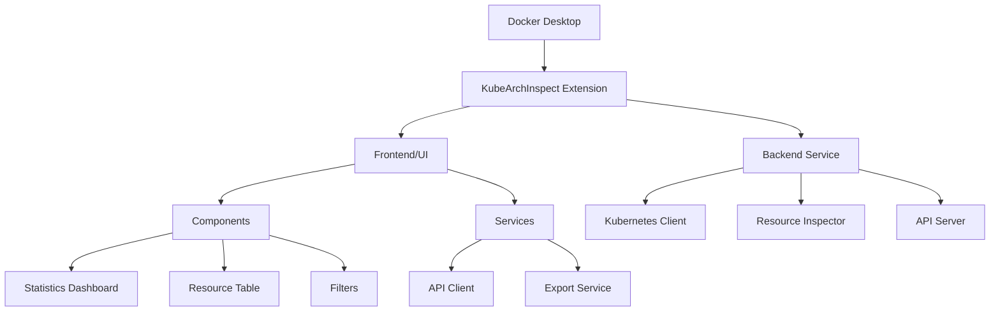

# KubeArchInspect Docker Extension

A Docker Desktop extension to inspect Kubernetes resources for ARM compatibility.

## Architecture



## Features

- Inspects various Kubernetes resources for ARM compatibility
- Real-time statistics and visualizations
- Filterable and sortable resource table
- Export capabilities

## Development

### Prerequisites

- Docker Desktop
- Node.js 18+
- Go 1.19+

### Building

```bash
docker buildx build -t kubearchinspect:latest .
docker extension install kubearchinspect:latest
```