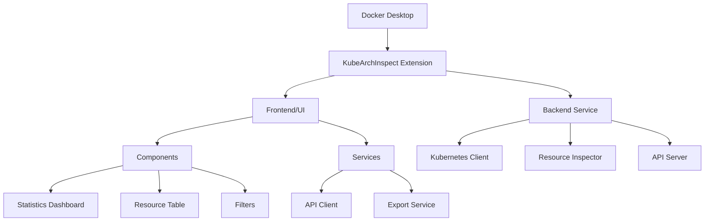

# KubeArchInspect Docker Extension

A Docker Desktop extension to inspect Kubernetes resources for ARM compatibility.

## Architecture



## Features

- Inspects various Kubernetes resources for ARM compatibility
- Real-time statistics and visualizations
- Filterable and sortable resource table
- Export capabilities

## Build and Installation

### Prerequisites

- Docker Desktop (latest version)
- Node.js 18+
- Go 1.19+
- Make

### Building from Source

1. Clone the repository:
```bash
git clone https://github.com/ajeetraina/kubearchinspect-docker-extension.git
cd kubearchinspect-docker-extension
```

2. Set up the development environment:
```bash
# Install backend dependencies
cd backend
go mod download
cd ..

# Install frontend dependencies
cd ui
npm install
cd ..
```

3. Build the extension:
```bash
# Build for both amd64 and arm64
make build-extension

# Or build for specific platform
docker buildx build --platform=linux/amd64 -t kubearchinspect:0.1.0 .
```

4. Install the extension:
```bash
make install-extension
```

### Development Mode

1. Enable development mode:
```bash
make dev
```

2. Start debugging:
```bash
make debug
```

3. Run tests:
```bash
# Run all tests
make test

# Run backend tests only
make test-backend

# Run frontend tests only
make test-frontend
```

### Troubleshooting

1. If you encounter build errors:
```bash
# Clean the build
make clean

# Rebuild
make build-extension
```

2. If the extension is not showing up:
```bash
# Remove the extension
make remove-extension

# Reinstall
make install-extension
```

3. For development issues:
```bash
# Check extension status
docker extension ls

# View extension logs
docker extension dev debug kubearchinspect
```

## Usage

1. Open Docker Desktop
2. Go to Extensions
3. Click on KubeArchInspect
4. Click "Inspect Resources" to analyze your Kubernetes resources

## Contributing

Contributions are welcome! Please read our [Contributing Guide](docs/CONTRIBUTING.md) for details on our code of conduct and the process for submitting pull requests.

## License

MIT
