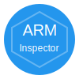

# KubeArchInspect Docker Extension

<p align="center">
  
</p>

<p align="center">
  <strong>Check if your Kubernetes cluster images support ARM64 architecture</strong>
</p>

<p align="center">
  <a href="#features">Features</a> •
  <a href="#installation">Installation</a> •
  <a href="#usage">Usage</a> •
  <a href="#development">Development</a> •
  <a href="#architecture">Architecture</a>
</p>

---

## Overview

KubeArchInspect is a Docker Desktop Extension that helps you determine which container images in your Kubernetes cluster support ARM64 architecture. This is essential for planning migrations to ARM-based infrastructure (like AWS Graviton, Apple Silicon, or Ampere processors).

## Features

- **🔍 Real Registry Inspection**: Queries container registries directly to check for multi-arch manifests
- **⚡ Concurrent Scanning**: Inspects multiple images simultaneously for fast results
- **📊 Visual Summary**: Dashboard with statistics on ARM64 compatibility across your cluster
- **🎯 Filter & Search**: Easily find specific images or filter by compatibility status
- **📥 Export Results**: Download scan results as CSV or JSON for further analysis
- **🔄 Multi-Context Support**: Switch between Kubernetes contexts without leaving Docker Desktop
- **📦 Comprehensive Scanning**: Checks Pods, Deployments, DaemonSets, and StatefulSets

## Screenshots

### Main Dashboard


### Results Table


## Installation

### From Docker Desktop Marketplace

1. Open Docker Desktop
2. Navigate to **Extensions** in the left sidebar
3. Search for "KubeArchInspect"
4. Click **Install**

### From Source

```bash
# Clone the repository
git clone https://github.com/ajeetraina/kubearchinspect-docker-extension.git
cd kubearchinspect-docker-extension

# Build the extension
docker build --tag=ajeetraina/kubearchinspect:latest .

# Install the extension
docker extension install ajeetraina/kubearchinspect:latest
```

### Update

```bash
docker extension update ajeetraina/kubearchinspect:latest
```

### Uninstall

```bash
docker extension uninstall ajeetraina/kubearchinspect:latest
```

## Usage

1. **Select Kubernetes Context**: Choose the cluster you want to inspect from the dropdown
2. **Choose Namespace**: Select a specific namespace or "All Namespaces"
3. **Click "Inspect Cluster"**: The extension will scan all container images
4. **Review Results**: 
   - Green indicates ARM64 compatible images
   - Red indicates images without ARM64 support
   - Orange indicates errors (e.g., private registries requiring authentication)
5. **Export**: Download results as CSV or JSON for reporting

### Filtering Results

Click on the summary cards to filter:
- **Total Images**: Show all results
- **ARM64 Compatible**: Show only ARM64-ready images
- **Not Compatible**: Show images missing ARM64 support
- **Errors**: Show images that couldn't be inspected

### Search

Use the search box to find specific:
- Image names
- Resource names
- Namespaces
- Resource types

## Prerequisites

- Docker Desktop 4.8.0 or later
- kubectl configured with access to your Kubernetes cluster(s)
- Network access to container registries (for manifest inspection)

## Architecture

```
┌─────────────────────────────────────────────────────────────┐
│                    Docker Desktop                            │
├─────────────────────────────────────────────────────────────┤
│  ┌──────────────────┐     ┌─────────────────────────────┐  │
│  │                  │     │                             │  │
│  │   Frontend UI    │────►│   Backend Service (Go)      │  │
│  │   (React/MUI)    │     │                             │  │
│  │                  │     │   • Unix Socket API         │  │
│  └──────────────────┘     │   • K8s Client-go           │  │
│                           │   • Registry Inspection     │  │
│                           │                             │  │
│                           └──────────┬──────────────────┘  │
│                                      │                      │
│                                      ▼                      │
│                           ┌─────────────────────────────┐  │
│                           │   Kubernetes Cluster        │  │
│                           │                             │  │
│                           │   • Pods                    │  │
│                           │   • Deployments             │  │
│                           │   • DaemonSets              │  │
│                           │   • StatefulSets            │  │
│                           └─────────────────────────────┘  │
│                                      │                      │
│                                      ▼                      │
│                           ┌─────────────────────────────┐  │
│                           │   Container Registries      │  │
│                           │                             │  │
│                           │   • Docker Hub              │  │
│                           │   • GCR / ECR / ACR         │  │
│                           │   • Private Registries      │  │
│                           └─────────────────────────────┘  │
└─────────────────────────────────────────────────────────────┘
```

### Backend

The Go backend provides:
- **Unix Socket API**: Following Docker Extension standards
- **Kubernetes Client**: Uses client-go to discover workloads
- **Registry Inspection**: Uses go-containerregistry to check OCI manifests
- **Concurrent Processing**: Semaphore-limited parallel image inspection

### Frontend

The React frontend provides:
- **Material-UI Components**: Docker-themed design
- **Real-time Updates**: Loading states and progress indication
- **Interactive Tables**: Sorting, filtering, and pagination
- **Export Functionality**: CSV and JSON download options

## Development

### Prerequisites

- Go 1.21+
- Node.js 18+
- Docker Desktop with Extensions enabled

### Local Development

```bash
# Backend
cd backend
go mod download
go build -o kubearchinspect .

# Frontend
cd ui
npm install
npm run dev
```

### Building the Extension

```bash
# Build multi-arch image
docker buildx build --platform linux/amd64,linux/arm64 \
  --tag ajeetraina/kubearchinspect:latest .
```

### Enable Developer Mode

```bash
docker extension dev ui-source ajeetraina/kubearchinspect:latest http://localhost:5173
```

### Debug Backend

```bash
docker extension dev debug ajeetraina/kubearchinspect:latest
```

## API Endpoints

| Endpoint | Method | Description |
|----------|--------|-------------|
| `/health` | GET | Health check |
| `/contexts` | GET | List available Kubernetes contexts |
| `/inspect` | GET | Inspect cluster images |

### Inspect Parameters

| Parameter | Type | Description |
|-----------|------|-------------|
| `context` | string | Kubernetes context name |
| `namespace` | string | Namespace to inspect ("all" for all namespaces) |

### Response Format

```json
{
  "results": [
    {
      "image": "nginx:latest",
      "isArmCompatible": true,
      "supportedArch": ["amd64", "arm64", "arm/v7"],
      "resourceType": "Deployment",
      "resourceName": "nginx-deployment",
      "namespace": "default"
    }
  ],
  "summary": {
    "total": 10,
    "armCompatible": 7,
    "notCompatible": 2,
    "errors": 1
  },
  "scanTime": "2025-01-15T10:30:00Z",
  "context": "docker-desktop",
  "namespace": "all"
}
```

## Troubleshooting

### No Contexts Found

Ensure kubectl is configured:
```bash
kubectl config get-contexts
```

### Permission Denied

Make sure your kubeconfig has the necessary permissions:
```bash
kubectl auth can-i get pods --all-namespaces
```

### Registry Authentication Errors

For private registries, the extension uses default authentication from:
- Docker config (`~/.docker/config.json`)
- Kubernetes image pull 
