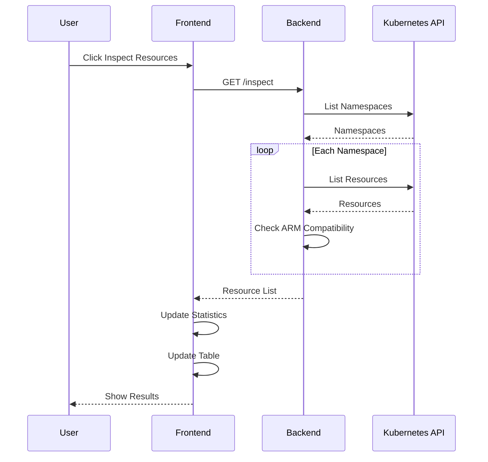

# KubeArchInspect Docker Extension

A Docker Desktop extension to inspect Kubernetes resources for ARM compatibility.

## Architecture

### Overall System Architecture


### Inspection Sequence


### UI Component Structure


## Features

- Inspects various Kubernetes resources for ARM compatibility
- Real-time statistics and visualizations
- Filterable and sortable resource table
- Export capabilities
- Detailed resource information

## Development

### Prerequisites

- Docker Desktop
- Node.js 18+
- Go 1.19+

### Building

```bash
# Build the extension
docker buildx build -t kubearchinspect:latest .

# Install the extension
docker extension install kubearchinspect:latest
```

### Development Mode

```bash
# Enable development mode
docker extension dev enable kubearchinspect

# View logs
docker extension dev debug kubearchinspect
```

## Testing

```bash
# Backend tests
go test ./...

# Frontend tests
cd ui && npm test
```

## Contributing

Contributions are welcome! Please read our contributing guidelines and submit pull requests.

## License

MIT
